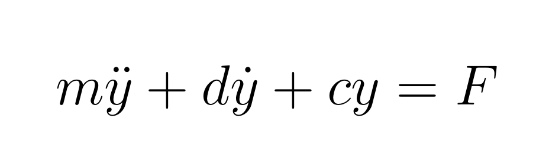

Modeling and Simulation
================

> This repository is for people starting with their **MATLAB** journey and are interested in modeling and simulation. Various topics will be tracked here like solving
> differential equations, solve problems using SIMULINK, plotting and other topics. If you have any other wishes, feel free to reach out to me on my social media channels.

 

🎥 - **Become a [Patreon](https://www.patreon.com/theengiineer)**

<table width="100%">
  <tr>
        <td width="50%"><a href="https://www.youtube.com/user/TheEngiineer/"></td>
        <td width="50%">
            

                     <a href="https://www.engineered-mind.com/post/l%C3%B6sung-einer-differentialgleichung-in-matlab-mit-dem-ode45-solver">Blog (German) </a> |
                     <a href="https://www.engineered-mind.com/post/solving-an-ordinary-differential-equation-in-matlab-with-the-ode45-solver">Blog (English) </a> |
                     <a href="https://github.com/jousefm/ModelingAndSimulation/tree/master/Code/ODE45">M-File & Function</a>
                     
In this repository you will find all the code and other relevant material regarding the ode45-solver and how to solve a single mass oscillator.
                     Video on this specific topic will be published on my YouTube channel in the future.
</td>
    </tr>
</table>
 

Social Media
================

  